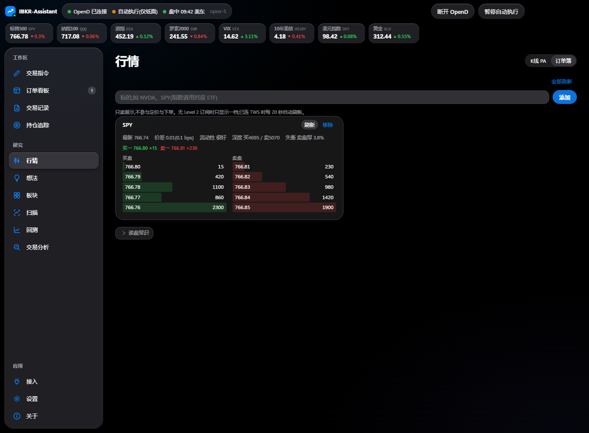

# Dafri Trading

用自然语言下单到 Interactive Brokers 的桌面交易台。大模型只负责把"买入 AAPL 100 股 limit 230,理由:回调到位"这样的中英混合指令翻译成结构化订单;限额、方向、账户、价差结构、时段、重复单的校验全部由代码完成,再经三道执行闸门才会发到券商。围绕下单之外,还带持仓追踪自动平仓、K 线价格行为分析、期权墙价位提醒、板块扫描、回测与交易复盘。

[](https://github.com/Dafrix69/trade/actions/workflows/ci.yml)

> 本仓库是软件实现,不构成任何投资建议。自动执行意味着解析错误会真金白银成交,请先在模拟账户跑够回归再考虑实盘。


## 功能

**交易指令** 一句话下单。正股、期权、垂直价差、蝴蝶、铁鹰、条件触发单都认;可勾选多个账户同时发单,每笔各一份、各自校验。SPX 蝴蝶行话(`1.8 挂15蝴蝶 15CM`)走本地速记解析,2 毫秒,不经过模型。模型可选 Anthropic Claude 或任意 OpenAI 兼容端点(如 DeepSeek),结构化输出 + zod 复验,提示注入样例进回归测试。

**三道执行闸门** 校验层复算名义金额与合约张数上限、方向与价差结构、账户映射、交易时段策略、10 分钟重复单防抖、置信度门槛;`auto_execute` 与 `allow_live_trading` 两个开关默认关闭;连续失败自动熔断,熔断时撤掉全部挂单。真实账号永远不进提示词,代码级检查。

| 订单看板 | 交易记录 |
|---|---|
|  |  |

**订单看板 / 交易记录** 排队中的条件单、已提交订单、通知流;记录是 append-only SQLite(触发器禁止改删),状态、成交、佣金、实现盈亏以事件追加,一键导出 JSON。


**持仓追踪** 对任一持仓设止盈、止损、跟踪止损、利润回撤(可按浮盈倍数分档、尾盘收紧)。到价后由引擎发出平仓单,蝴蝶等组合按 BAG 限价单整体平;也可托管到券商侧挂 GTC 单。每秒盯一轮,盯盘在本机,软件必须开着。


**行情 · K 线 PA** 1 分钟到日线的实时 K 线,纯代码算摆动结构、BOS / CHoCH、关键位、FVG、扫单、K 线形态、ATR,打一个 -100 到 +100 的分,给出确认条件与失效条件;高周期背景一并对照。图上每条线都对应引擎算出的字段,界面不自己算。可选让模型只做解读,不给价格。



**行情 · 订单簿** 一档或多档盘口、价差、深度、失衡,用来判断 AUTO_MID 定价会不会永远不成交。


**板块 · 价位提醒** 输入一个主题,AI 选出成分股并可打业务标签;每只股票一条价位条:期权持仓量墙 / 成交量墙、最大痛点、γ 翻转、均线、52 周高低、整数关口,穿越时提醒。


**扫描** 对板块成分股批量算 RS 强度(1 周到 1 年五个窗口,对 SPY 或 QQQ,按标签汇总)、拐点筛选(MACD 背离,日线与周线)、极值偏离(偏离度 z 分数与压力)。


**回测** 买入持有、均线交叉、RSI 超卖、N 日突破、自定义多条件五种策略,条件搭建器实时生成流程图,净值曲线与买卖点标在图上。日线、收盘成交、全仓进出,只作研究。


**交易分析** 从 IBKR 逐笔成交自动合成蝴蝶(1 条 BAG + 3 条腿),画出行权价、到期盈利区、开仓与结局,按规则给出八条结论;叠加蝶价走势回放止盈策略(分档止盈、止损、回撤激活)。

**其他** 想法备忘与 AI 知识提炼;顶栏宏观行情带(标普、纳指、VIX、美债、美元、黄金);TWS / OpenD 连接检测与诊断;深浅色与涨跌配色随系统。

## 它怎么工作

```
Electron 桌面端 ──stdio JSON-RPC──▶ 交易引擎(Node 子进程,engine-ts)──▶ TWS / IB Gateway(127.0.0.1)
   renderer ↔ contextBridge 白名单        ├─ 解析:本地速记 → 大模型            ├─ 富途 OpenD(桥待真机联调)
   IPC 发起方校验 + 敏感操作确认           ├─ 校验层 → 三道闸门 → 下单层         └─ 公开数据源(指数、宏观)
                                          └─ append-only SQLite + 熔断文件
```

- 引擎与界面之间没有监听端口,只有 stdio。RPC 分三条道:本地读写即来即答,行情类读请求并发,下单类请求严格顺序。
- 桌面端 `contextIsolation` / `sandbox` 全开,渲染层拿不到 Node;下单、改限额、连券商必须带界面确认标记。
- API Key 与富途解锁密码存系统 Keychain / DPAPI,不落配置文件。
- 引擎行为由 `engine-ts/baseline/` 里的黄金基线钉住,`npx vitest run` 全部离线跑完。

## 安装

**Windows**:到 [Releases](https://github.com/Dafrix69/trade/releases) 下载 `DafriTrading-<版本>-win-x64.exe` 安装。安装包未签名,SmartScreen 会拦,「更多信息 → 仍要运行」。机器上不需要装 Node 或 Python。

**macOS**:需要在 Mac 上自行打包(`cd desktop && npm run dist:mac`),首次打开右键 → 打开,或 `xattr -dr com.apple.quarantine`。

**运行前提**

1. IBKR 的 TWS 或 IB Gateway 已登录并打开 API(默认模拟账户端口 7497,实盘 7496)。建议先只用模拟账户。
2. 一个大模型 API Key:Anthropic,或任意 OpenAI 兼容端点。
3. 首次启动会从示例生成配置;在「接入 → 大模型」填 Key,在「接入 → TWS」检测连接,在「设置」核对限额与开关。

同一 IBKR 用户名在别处登录时,行情会跟着那边走,本机会拿不到 K 线;先在别处登出。

## 从源码运行

```bash
git clone https://github.com/Dafrix69/trade.git dafritrade && cd dafritrade
(cd engine-ts && npm install && npm run build)     # Node >= 22
cd desktop && npm install && npm start             # 启动前会自动确认引擎已编译
```

```bash
cd engine-ts && npx tsc --noEmit && npx vitest run  # 引擎:单测 + 黄金回归 + RPC 契约回放,全部离线
cd desktop && npm run ui:typecheck                  # 界面类型检查(React + TS)
cd desktop && npm run ui:preview \
  && npx electron tools/capture_pages.js renderer-react/dist-preview/index.html .uipreview/check --check   # 界面 smoke:每页各点一遍,控制台零报错
```

命令行也能用同一个引擎:`node dist/src/cli.js selftest | validate | parse | run | rpc`,危险程度递增,`run` 必须带 `--i-understand-this-places-real-orders`。

## 配置

`config/settings.json`(从 `settings.example.json` 生成,含账户映射,永不进仓库):

| 段 | 说明 |
|---|---|
| `limits` | 单笔名义金额、期权张数、市价单股数、最小置信度、价差滑点、重复单窗口 |
| `policies` | `auto_execute`、`allow_live_trading`、`allow_combo_live`、触发价复核、休市市价单策略、连续失败熔断阈值 |
| `connections` / `accounts` | TWS 端口与 client id;账户别名 → 真实账号,`is_paper` 决定实盘闸门 |
| `symbol_aliases` / `index_symbols` | 「苹果 → AAPL」这类别名;SPX 的交易所与交易类 |
| `prompt_version` | 提示词版本,`prompts/` 下按版本号只增不改,一行回滚 |

更细的设计决策与口径按模块放在 [docs/features](docs/features):[界面](docs/features/ui.md)、[引擎 RPC](docs/features/engine-rpc.md)、[持仓追踪](docs/features/tracker.md)、[K 线 PA](docs/features/priceaction.md)、[期权墙与价位提醒](docs/features/optionwall-alerts.md)、[交易分析](docs/features/tradereview.md)、[双账户发单](docs/features/dual-account.md)、[富途 OpenD](docs/features/futu-opend.md) 等。

## 仓库布局

| 目录 | 内容 |
|---|---|
| `engine-ts/` | 交易引擎(TypeScript):`src/` 实现、`tests/` 测试、`baseline/` 回归基线、`examples/` 校验样例 |
| `desktop/` | Electron 桌面端:主进程、preload、`renderer-react/` 界面(React + Ant Design 5,Vite 构建;壳 / 页面 / store 分层,见 `docs/features/ui.md`)、`tools/` 预览数据源 / 截图 smoke / 压测 / 打包 |
| `prompts/` | 提示词资产,按版本号只增不改 |
| `config/` | `settings.example.json` |
| `docs/` | `features/` 功能文档、`journal/` 事故记录、`briefs/` 与 `reports/` 历史文档、`screenshots/` |

## 状态

- IBKR 通道在模拟账户上真机核对过:连接、下单、状态与成交回报、佣金、撤单、熔断。
- 富途 OpenD 通道:检测与诊断可用,下单桥在真机核对前显式不可用。
- 安装包未签名;macOS 公证需要自己的开发者证书。
