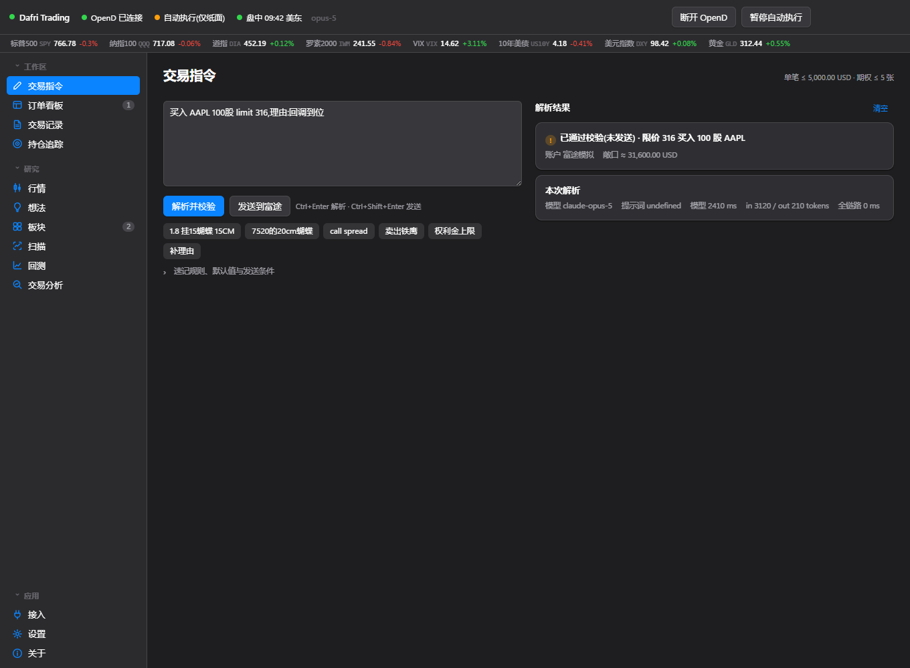
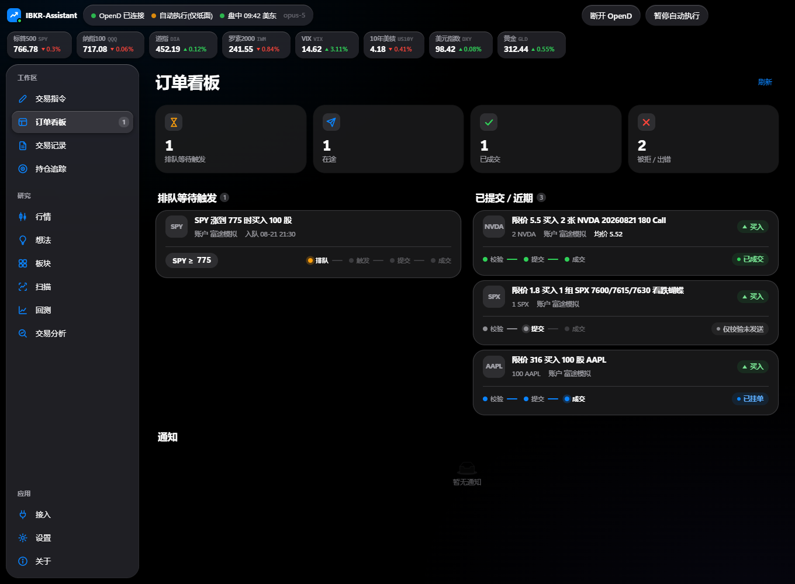
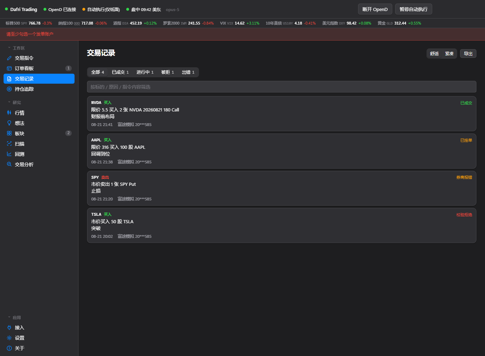
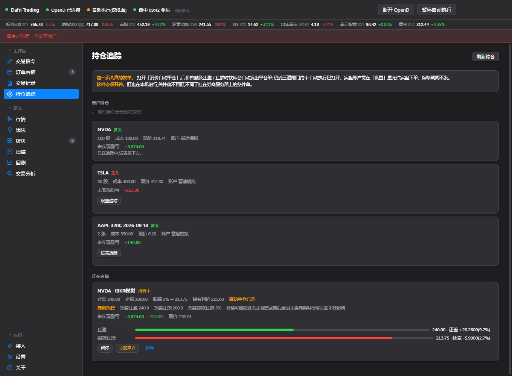
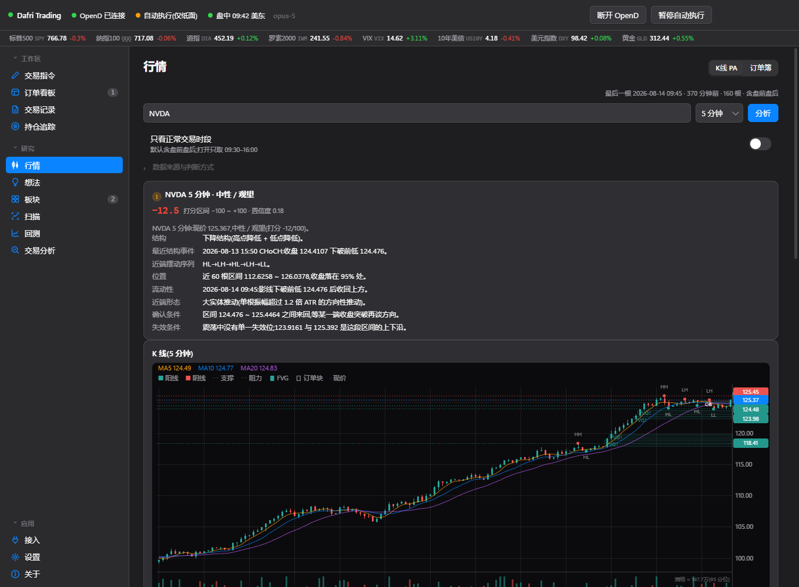
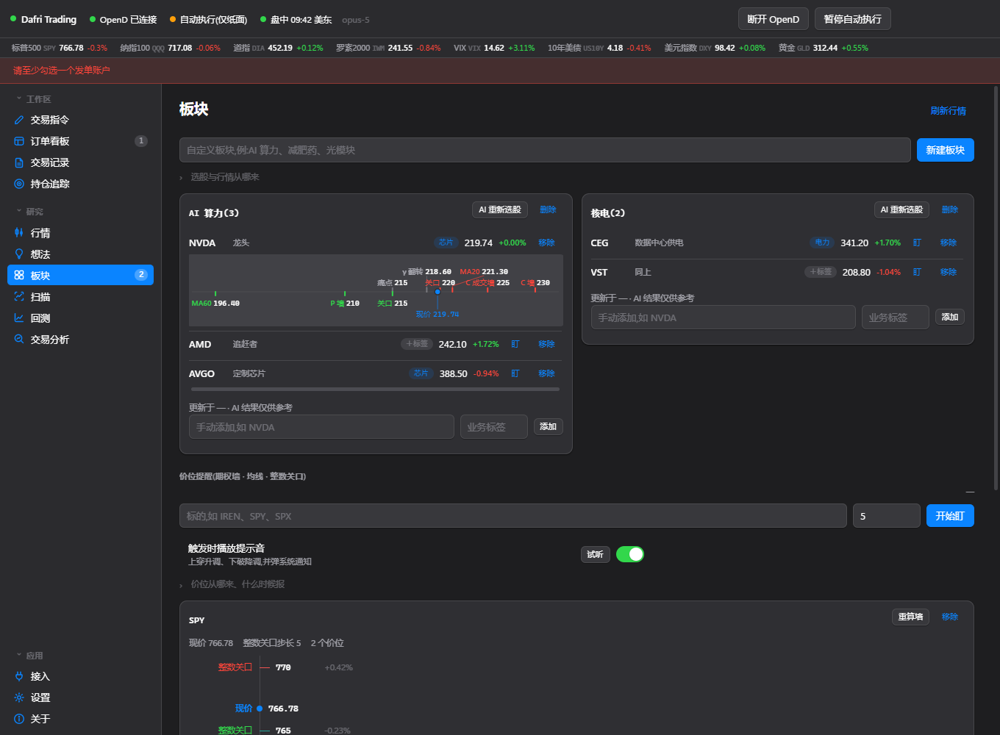
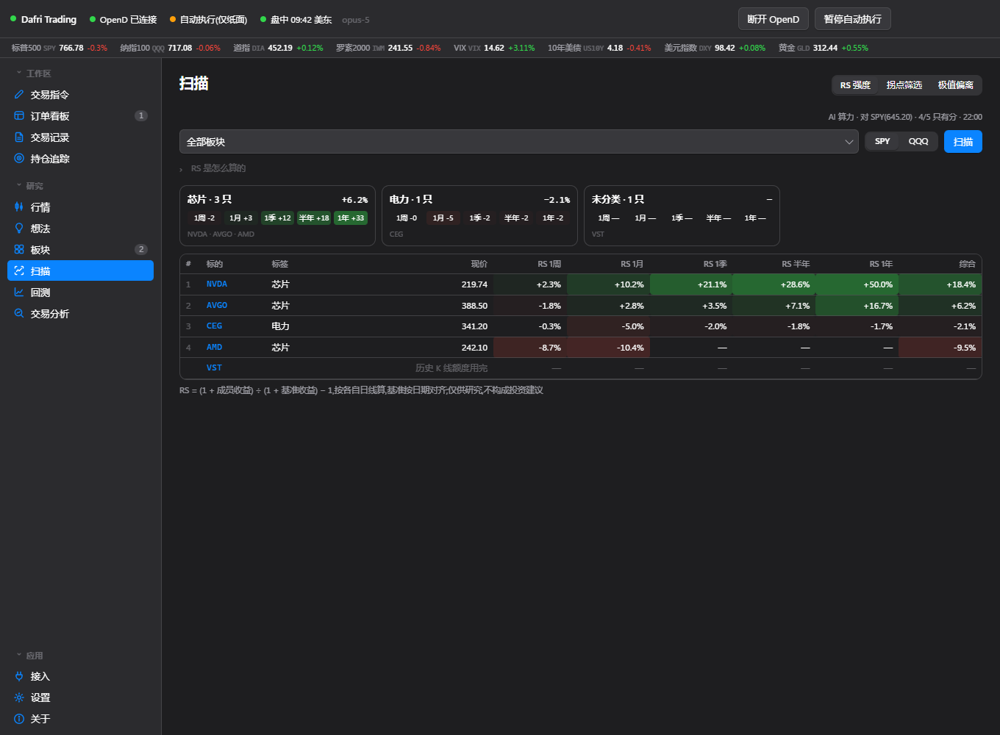
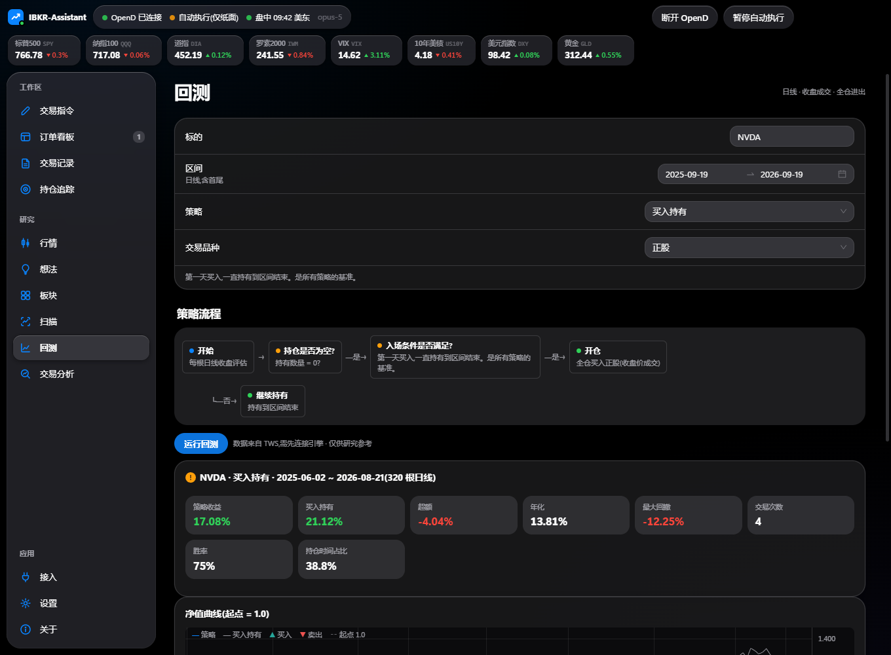
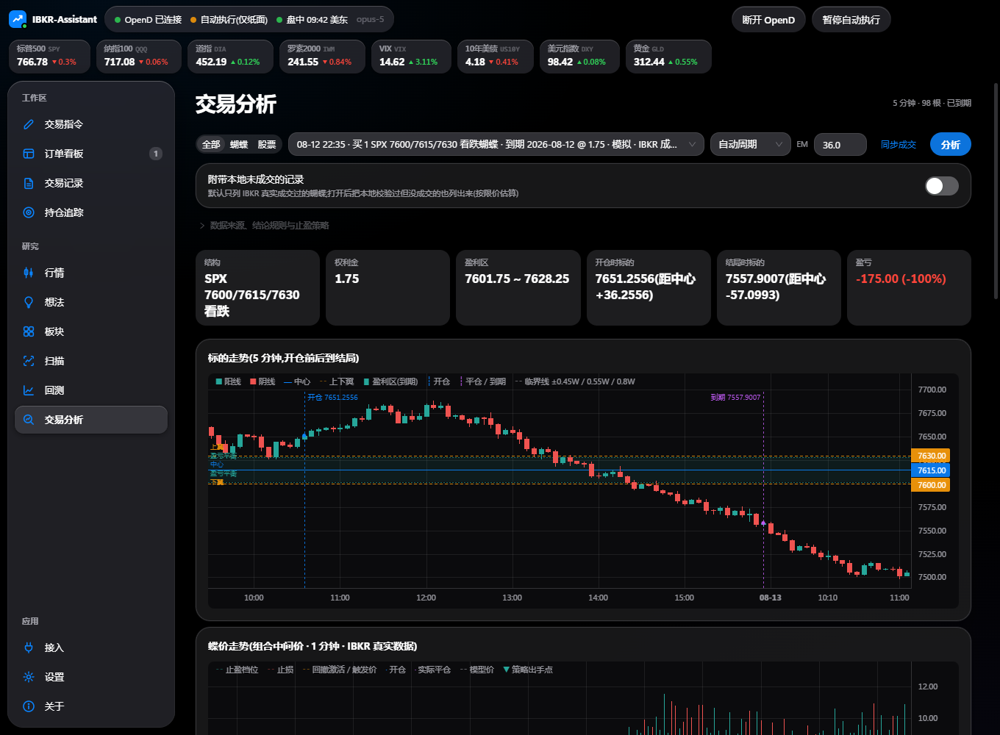

# IBKR-Assistant

用自然语言下单到 Interactive Brokers 的桌面交易台。大模型只负责把"买入 AAPL 100 股 limit 230,理由:回调到位"这样的中英混合指令翻译成结构化订单;限额、方向、账户、价差结构、时段、重复单的校验全部由代码完成,再经三道执行闸门才会发到券商。围绕下单之外,还带持仓追踪自动平仓、K 线价格行为分析、期权墙价位提醒、板块扫描、回测与交易复盘。

[](https://github.com/Dafrix69/IBKR-Assistant/actions/workflows/ci.yml)
[](LICENSE)

> 本仓库是软件实现,不构成任何投资建议。自动执行意味着解析错误会真金白银成交,请先在模拟账户跑够回归再考虑实盘。



## 功能

**交易指令** 一句话下单。正股、期权、垂直价差、蝴蝶、铁鹰、条件触发单都认;可勾选多个账户同时发单,每笔各一份、各自校验。SPX 蝴蝶行话(`1.8 挂15蝴蝶 15CM`)走本地速记解析,2 毫秒,不经过模型。模型可选 Anthropic Claude 或任意 OpenAI 兼容端点(如 DeepSeek),结构化输出 + zod 复验,提示注入样例进回归测试。

**三道执行闸门** 校验层复算名义金额与合约张数上限、方向与价差结构、账户映射、交易时段策略、10 分钟重复单防抖、置信度门槛;「允许自动执行」与「允许实盘账户下单」两个开关(`auto_execute` / `allow_live_trading`)默认关闭;连续失败自动熔断,熔断时撤掉全部挂单。被拦下的单用中文说明是谁拒的(模型、校验、引擎、券商)、为什么、去哪里打开。真实账号永远不进提示词,代码级检查。

**保护规则 · 执行对账** 熔断管的是软件坏了,保护规则管的是今天不顺:接连止损、已实现盈亏从峰值回撤过大时暂停一段时间的新单,当天(美东)净亏到日内亏损上限就停到第二天,同一标的刚平仓后冷却。四条默认全关,只挡新单、永不挡平仓,状态从库里现算、到点自己解除。重启应用或重连券商之后,引擎每分钟把券商侧的在途单与本地记录对一遍:还挂着的认领回来,已成交的按成交回报补录终态,两边都查不到的只标「去向不明」,不替你作废。

| 订单看板 | 交易记录 |
|---|---|
|  |  |

**订单看板 / 交易记录** 排队中的条件单、已提交订单、通知流;记录是 append-only SQLite(触发器禁止改删),状态、成交、佣金、实现盈亏以事件追加,一键导出 JSON。



**持仓追踪** 对任一持仓设止盈、止损、跟踪止损、利润回撤(可按浮盈倍数分档、尾盘收紧)。也可以只填**标的目标价**("SPX 到 7740 就走"):引擎按各腿当前报价反解的波动率,每秒把它换算成这份持仓那时该值的价,正股、单腿期权、蝴蝶 / 价差都认,填的时候就摆出预计价位与预估收益。到价后由引擎发出平仓单,蝴蝶等组合按 BAG 限价单整体平;也可托管到券商侧挂 GTC 单,由引擎每秒原地改价。

触发之后是**追价平仓**:平仓单挂在各腿买卖价合成的立刻成交价上,头两秒不动,之后每秒再让一跳,让到设定上限(默认 10%)为止,只朝成交方向动、改的始终是同一张单。部分成交不缩量,手动「立即平仓」遇到已有的托管单会改它而不是另发。个股期权收盘后没有报价时,持仓按昨收显示组合价与盈亏并标明,但昨收不进任何触发判断。每秒盯一轮,盯盘在本机,软件必须开着。停在这一页时,「账户持仓」的现价与盈亏也是每秒一刷(IBKR 读引擎常驻订阅的缓存;富途每次是真查询,5 秒一次)。



**行情** 一页看一个标的。上面是 1 分钟到日线的实时 K 线,纯代码算摆动结构、BOS / CHoCH、关键位、FVG、扫单、K 线形态、ATR,打一个 -100 到 +100 的分,给出确认条件与失效条件;高周期背景一并对照。图上每条线都对应引擎算出的字段,界面不自己算。可选让模型只做解读,不给价格。图下面就是这个标的的盘口:一档或多档、价差、深度、失衡,用来判断 AUTO_MID 定价会不会永远不成交;页面下半还能同时关注最多 12 个盘口,点代码就换成上面正在看的标的。



**板块 · 价位提醒** 输入一个主题,AI 选出成分股并可打业务标签;每只股票一条价位条:期权持仓量墙 / 成交量墙、最大痛点、γ 翻转、均线、52 周高低、整数关口,穿越时提醒;短期内反复碰同一条日均线(默认 10 个交易日里第 3 次)也提醒。



**扫描** 对板块成分股一次扫完、合成一张表:每只股一行,RS 强度(1 周到 1 年五个窗口,对 SPY 或 QQQ,表上方按标签汇总)与各周期的拐点(MACD 背离,周线到 15 分钟,可选均线确认)并排,表头可排序。点哪一行,下面就是这只的极值偏离(偏离度 z 分数与买卖压力),上一只 / 下一只跟着表的顺序翻。
表下面是**强势股筛选**:把实盘比赛优胜者公开过的选股规则逐条变成代码检查——Minervini 的趋势模板 8 条(第二阶段上升趋势)与 VCP 波动收缩形态(回撤一次比一次浅、缩量、放量过枢轴),O'Neil / IBD 的 RS 评级,以及放在最上面的大盘方向(基准在不在均线上、近 25 个交易日有几个派发日)。只用日线,要财报的那几条不假装算。



**回测** 买入持有、均线交叉、RSI 超卖、N 日突破、自定义多条件五种策略,条件搭建器实时生成流程图,净值曲线与买卖点标在图上。日线、收盘成交、全仓进出,只作研究。可以按每边成交成本扣费;「参数扫描 · 样本外」把一批参数只在样本内挑、看样本外成绩,再做滚动前推,几只标的一起扫时得分取平均。



**交易分析** 蝴蝶与股票的复盘,页面顶上按「全部 / 蝴蝶 / 股票」筛。蝴蝶从 IBKR 逐笔成交自动合成(1 条 BAG + 3 条腿),画出行权价、到期盈利区、开仓与结局,按规则给出八条结论;叠加蝶价走势回放止盈策略(分档止盈、止损、回撤激活)。股票按一段持仓算一笔(从空仓到空仓,中途加仓、分批卖出都在里面):进场与出场落在持有期区间的什么位置、最大浮盈浮亏与兑现率、卖出之后是"没吃到"还是"躲开了"。TWS 只给当天的成交,所以期初仓位用当前持仓反推;卖的是更早买的货时只复盘出场,成本与盈亏不编。没连券商、读不到持仓时同样不把卖出读成卖空,并标明「期初持仓未核对」。股票那张图的窗口按**交易日**给(至少 5 个交易日,持仓更长就按全长、前后各留一天),不会塌成成交当天的日内。

**绩效体检** 交易分析一次看一笔,这一页看全部:把已了结的蝴蝶、股票、导入的期权摊成一本美元账,算出实盘比赛优胜者天天盯的那几个数——胜率、盈亏比、期望值、R 倍数与 SQN、平仓权益曲线的最大回撤与恢复因子、连胜连亏,再按品种、开仓时段、星期、标的拆开看优势在哪儿。然后按写死的规则挑行为上的毛病:赚小亏大、一笔大亏吃掉一周、亏损单拿得比赚钱单久、亏完半小时内再进、亏后加码、做得越多亏得越多,每条写明借鉴自谁(Van Tharp、Minervini、Larry Williams、Andrea Unger、Kevin Davey……)。附一个固定风险比例的仓位计算器。股票按建追踪时的初始止损算 R;自动平仓按触发价对成交价算执行损耗;按账本给保护规则的建议参数,点了才写进设置。最下面的「信号成绩单」给价位提醒与盯异动发出的每条信号按之后 1 / 5 / 20 天打分,和随手一天比。全部本机代码算,不调模型。

**其他** 股票池盯价位与盯异动(放量、急涨急跌,置顶不抢焦点的提醒弹窗);想法备忘与 AI 知识提炼;顶栏宏观行情带(标普、纳指、VIX、美债、美元、黄金);TWS / OpenD 连接检测与诊断。界面是 iOS 27 风格的 Liquid Glass,玻璃透明度在「设置」里调,深浅色与涨跌配色随系统。

## 它怎么工作

```
Electron 桌面端 ──stdio JSON-RPC──▶ 交易引擎(Node 子进程,engine-ts)──▶ TWS / IB Gateway(127.0.0.1)
   renderer ↔ contextBridge 白名单        ├─ 解析:本地速记 → 大模型            ├─ 富途 OpenD(桥待真机联调)
   IPC 发起方校验 + 敏感操作确认           ├─ 校验层 → 三道闸门 → 下单层         └─ 公开数据源(指数、宏观)
                                          └─ append-only SQLite + 熔断文件
```

- 引擎与界面之间没有监听端口,只有 stdio。RPC 分三条道:本地读写即来即答,行情类读请求并发,下单类请求严格顺序。
- 桌面端 `contextIsolation` / `sandbox` 全开,渲染层拿不到 Node;下单、改限额、连券商必须带界面确认标记。
- API Key 与富途解锁密码存系统凭证库(macOS Keychain / Windows 凭据管理器),不落配置文件。
- 引擎行为由 `engine-ts/baseline/` 里的黄金基线钉住,`npx vitest run` 全部离线跑完。

## 安装

两个平台的安装包都在 [Releases](https://github.com/Dafrix69/IBKR-Assistant/releases) 里。装的机器上**不需要 Node 或 Python**,引擎打在包里。

**Windows** x64:下载 `IBKR-Assistant-<版本>-win-x64.exe`。未签名,SmartScreen 会拦,「更多信息 → 仍要运行」。

**macOS** Apple Silicon(需 macOS 12 以上,Intel Mac 不支持):下载 `IBKR-Assistant-<版本>-mac-arm64.dmg`。
未签名、未公证,首次打开右键 → 打开,或 `xattr -dr com.apple.quarantine "/Applications/IBKR-Assistant.app"`。
在 Mac 上本地打也行:`cd desktop && npm run dist:mac`。

两个包都由 `安装包` 工作流出(`.github/workflows/package.yml`:手动 Run workflow、推 `v*` 标签、改到打包相关文件的 PR
都会触发)。推 `v*` 标签时两个包一起打,都通过了才挂到对应的 Release——任一平台挂了就不发版。
工作流不只是编译:核对 DMG 完整性与原生模块的架构、用包里的 Electron 拉起包里的引擎、
再真把应用启动 30 秒确认不闪退且引擎子进程起来了。

**运行前提**

1. IBKR 的 TWS 或 IB Gateway 已登录并打开 API(默认模拟账户端口 7497,实盘 7496)。建议先只用模拟账户。
2. 一个大模型 API Key:Anthropic,或任意 OpenAI 兼容端点。
3. 首次启动会从示例生成配置;在「接入 → 大模型」填 Key,在「接入 → TWS」检测连接,在「设置」核对限额与开关。

同一 IBKR 用户名在别处登录时,行情会跟着那边走,本机会拿不到 K 线;先在别处登出。

## 从源码运行

```bash
git clone https://github.com/Dafrix69/IBKR-Assistant.git dafritrade && cd dafritrade
(cd engine-ts && npm install && npm run build)     # Node >= 22
cd desktop && npm install && npm start             # 启动前会自动确认引擎已编译
```

```bash
cd engine-ts && npm run lint && npm run depcruise && npx tsc --noEmit && npx vitest run   # 引擎:lint、模块边界、单测 + 黄金回归 + RPC 契约回放,全部离线
cd desktop && npm run lint && npm run depcruise && npm run ui:typecheck                   # 界面:lint、分层、类型检查(React + TS)
cd desktop && npm run ui:preview \
  && npx electron tools/capture_pages.js renderer-react/dist-preview/index.html .uipreview/check --check   # 界面 smoke:每页各点一遍,控制台零报错
cd engine-ts && npm run probe                        # 真机只读联调:临时配置与临时库、三道闸强制关、只准调只读 RPC
```

引擎与界面各有一份分层规则(`.dependency-cruiser.cjs`,依赖只能往下流),CI 里排在 lint 之后;改代码的规矩——分层、RPC 契约四处同步、黄金基线怎么改、单文件体积预算——写在根目录的 [CLAUDE.md](CLAUDE.md)。其中三项不只是写着,还各有一条**只许变短**的测试钉着:RPC 契约(界面与引擎之间全部 81 个方法都从契约走,绕过契约编译不过)、桌面端 RPC 白名单与敏感方法表(两边双向对)、单文件体积预算。换了 IBKR 用户名或 TWS 升级之后先跑一遍 `npm run probe`:行情订阅按用户名算、不按账户,它会逐个品种把 TWS 的原话摆出来。

命令行也能用同一个引擎:`node dist/src/cli.js selftest | validate | parse | run | rpc`,危险程度递增,`run` 必须带 `--i-understand-this-places-real-orders`。

## 配置

`config/settings.json`(从 `settings.example.json` 生成,含账户映射,永不进仓库):

| 段 | 说明 |
|---|---|
| `limits` | 单笔名义金额、期权张数、市价单股数、最小置信度、价差滑点、重复单窗口 |
| `policies` | `auto_execute`、`allow_live_trading`、`allow_combo_live`、触发价复核、休市市价单策略、连续失败熔断阈值 |
| `protections` | 保护规则:止损护栏、回撤护栏、同标的冷却、日内亏损上限。默认全关,只挡新单、永不挡平仓,到点自己解除 |
| `risk_budget` | 单笔风险预算:按账户填权益,期权最坏亏损 / 股票名义金额占比超线时在订单上提醒,不拦单。默认关 |
| `connections` / `accounts` | TWS 端口与 client id;账户别名 → 真实账号,`is_paper` 决定实盘闸门 |
| `symbol_aliases` / `index_symbols` | 「苹果 → AAPL」这类别名;SPX 的交易所与交易类 |
| `prompt_version` | 提示词版本,`prompts/` 下按版本号只增不改,一行回滚 |

更细的设计决策与口径按模块放在 [docs/features](docs/features):[界面](docs/features/ui.md)、[引擎 RPC](docs/features/engine-rpc.md)、[持仓追踪](docs/features/tracker.md)、[执行对账](docs/features/reconcile.md)、[保护规则](docs/features/protections.md)、[K 线 PA](docs/features/priceaction.md)、[期权墙与价位提醒](docs/features/optionwall-alerts.md)、[反复碰均线](docs/features/ma-touch.md)、[股票池:盯价位与盯异动](docs/features/quality-watch.md)、[交易分析](docs/features/tradereview.md)、[绩效体检](docs/features/performance.md)、[单笔风险预算](docs/features/risk-budget.md)、[回测成本与参数扫描](docs/features/backtest-lab.md)、[信号成绩单](docs/features/signal-scorecard.md)、[强势股筛选](docs/features/leaders.md)、[双账户发单](docs/features/dual-account.md)、[富途 OpenD](docs/features/futu-opend.md)、[依赖选型](docs/features/dependencies.md) 等。

出问题要现场:主进程、引擎 stderr、渲染层报错都写进 `userData/logs/main.log`(滚动,单份 4 MB),路径在「关于」页。

## 仓库布局

| 目录 | 内容 |
|---|---|
| `engine-ts/` | 交易引擎(TypeScript):`src/` 实现、`tests/` 测试、`baseline/` 回归基线、`examples/` 校验样例 |
| `desktop/` | Electron 桌面端:主进程、preload、`renderer-react/` 界面(React + Ant Design 5,Vite 构建;壳 / 页面 / store 分层,见 `docs/features/ui.md`)、`tools/` 预览数据源 / 截图 smoke / 压测 / 打包 |
| `prompts/` | 提示词资产,按版本号只增不改 |
| `config/` | `settings.example.json` |
| `docs/` | `features/` 功能文档、`journal/` 事故记录、`briefs/` 与 `reports/` 历史文档、`screenshots/` |

## 状态

- IBKR 通道在模拟账户上真机核对过:连接、下单、状态与成交回报、佣金、撤单、熔断;托管蝴蝶止盈单的秒级原地改价、重启认领、成交落闩。
- 追价平仓(让价节奏、非托管平仓单改价、部分成交后改总量)目前只有离线测试,尚未在真机上核对。
- 执行对账(重启 / 重连后认领在途单)与保护规则(止损护栏、回撤护栏、同标的冷却、日内亏损上限)目前只有离线测试,尚未在真机上核对。
- 执行损耗、单笔风险预算、信号记录(2026-09-26 加的)目前只有离线测试;信号成绩单要攒够信号才有结论。
- 富途 OpenD 通道:检测与诊断可用,下单桥在真机核对前显式不可用。
- 安装包未签名;macOS 公证需要自己的开发者证书。

## 许可证

[MIT](LICENSE)。可以自由使用、修改、再分发(包括商用),保留版权与许可声明即可。软件按"原样"提供,不附带任何担保;
用它下单产生的盈亏与风险由使用者自己承担。

依赖各自沿用原来的许可证,不因本项目改变。其中 TradingView Lightweight Charts 是 Apache-2.0,按它的要求在「关于」页保留了署名。
