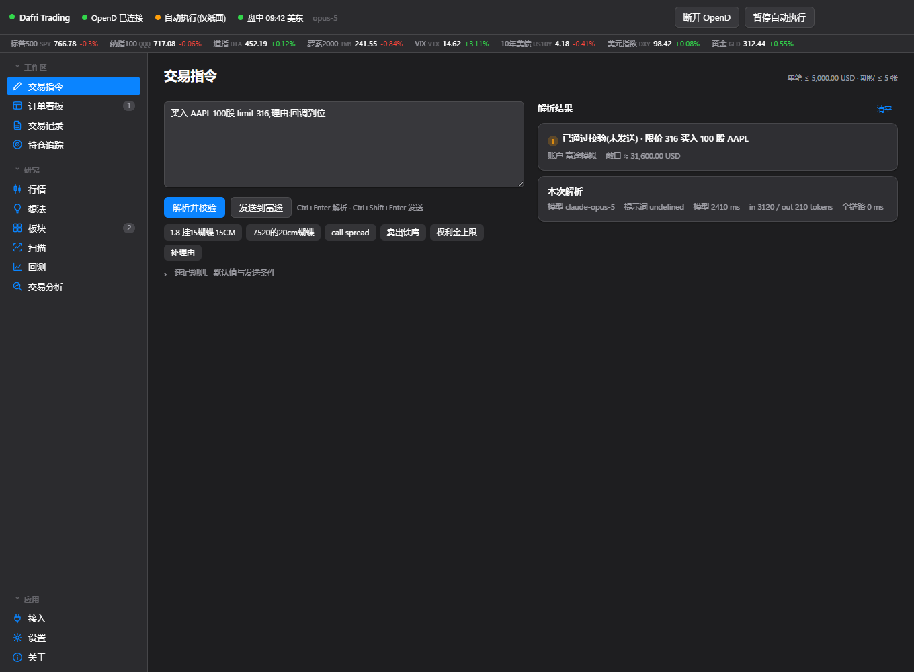
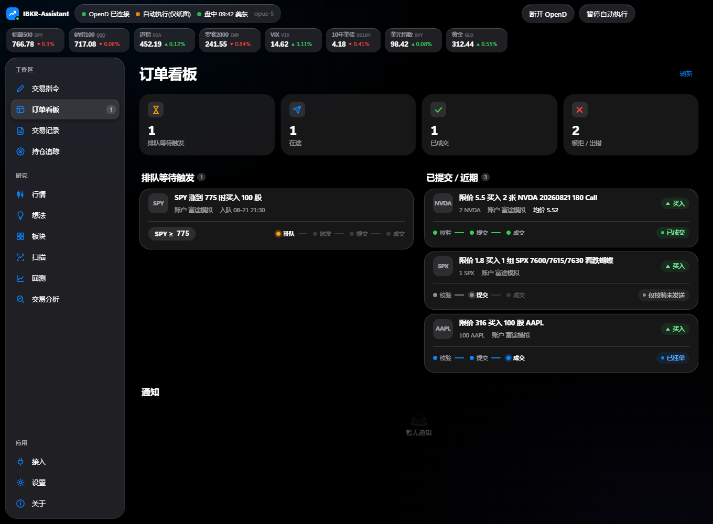
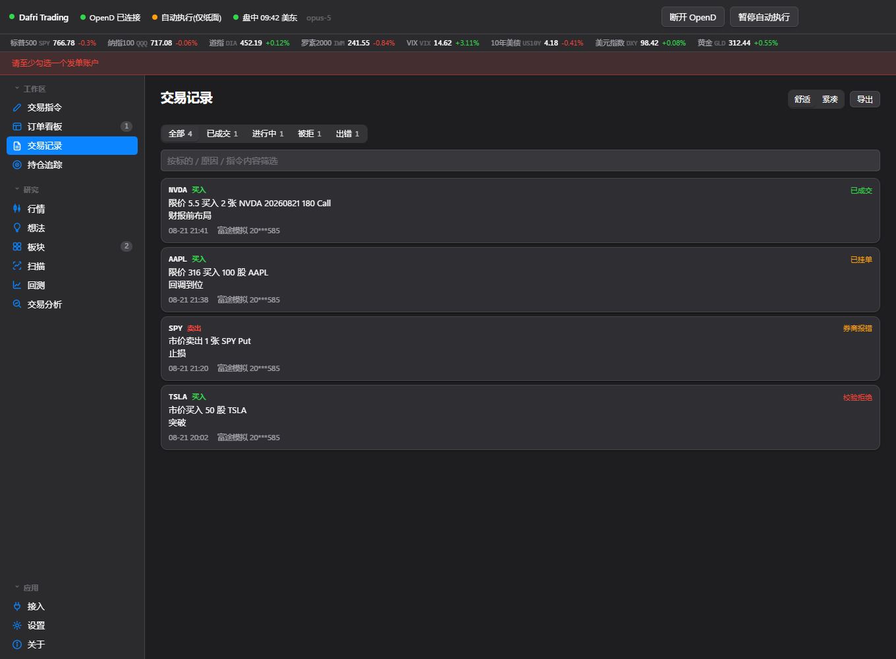
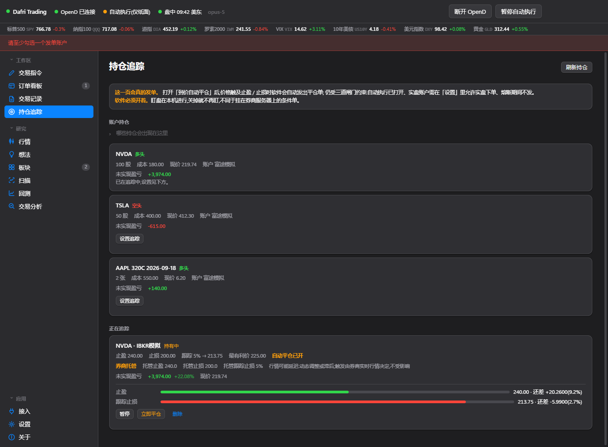
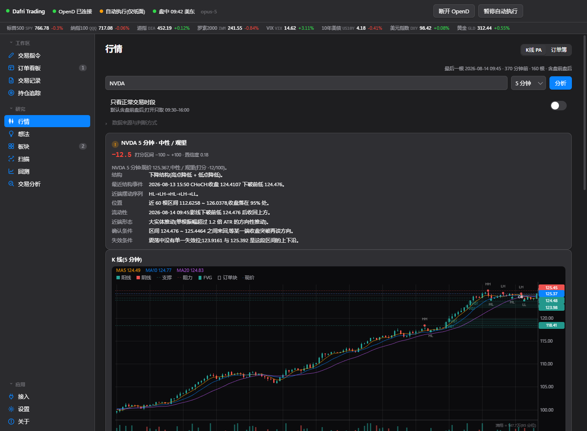
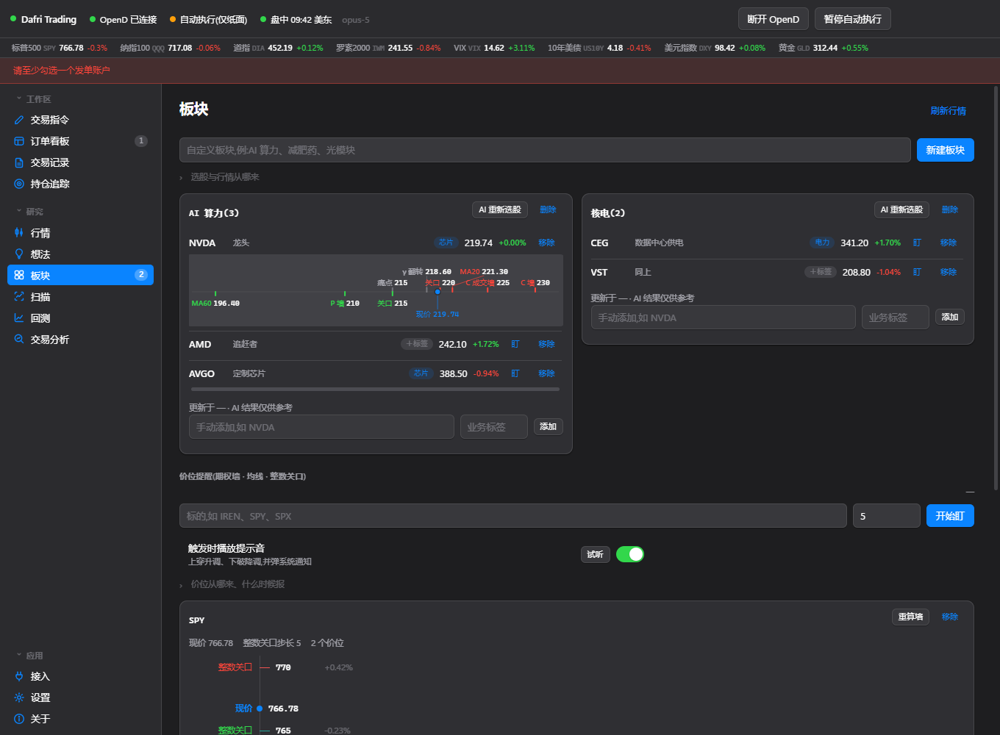
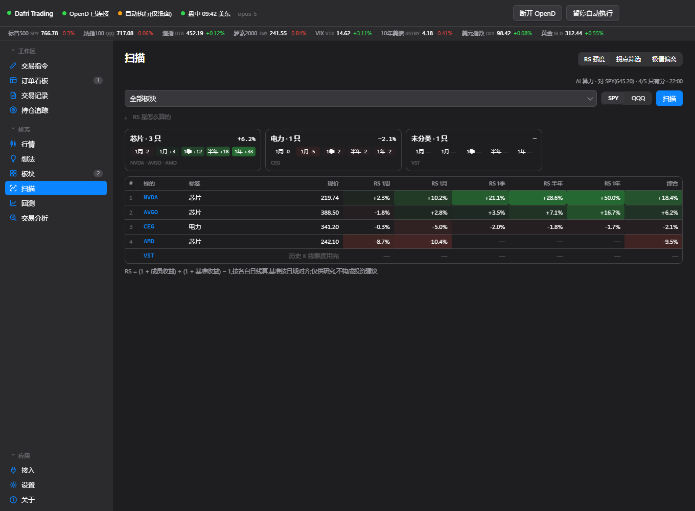
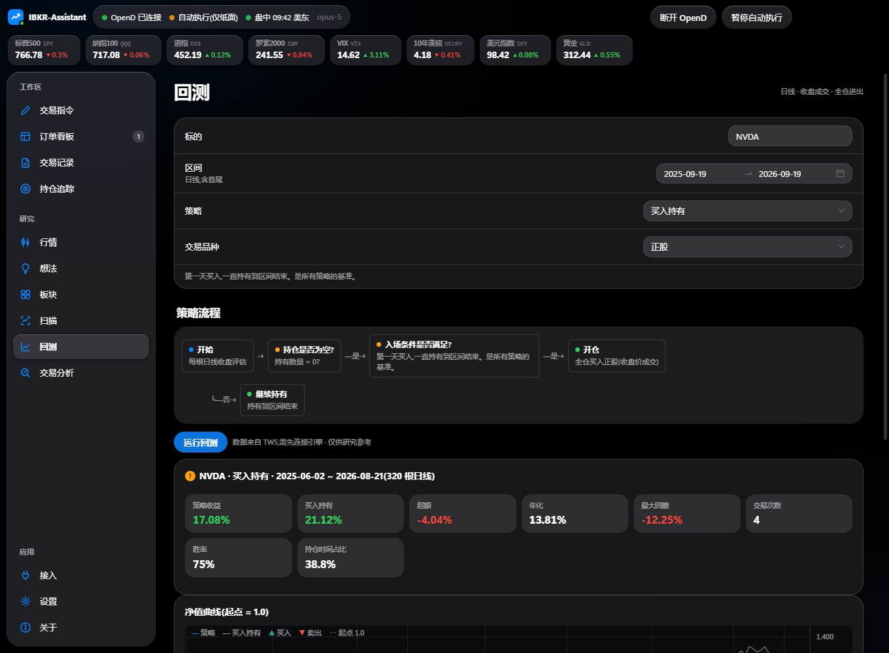
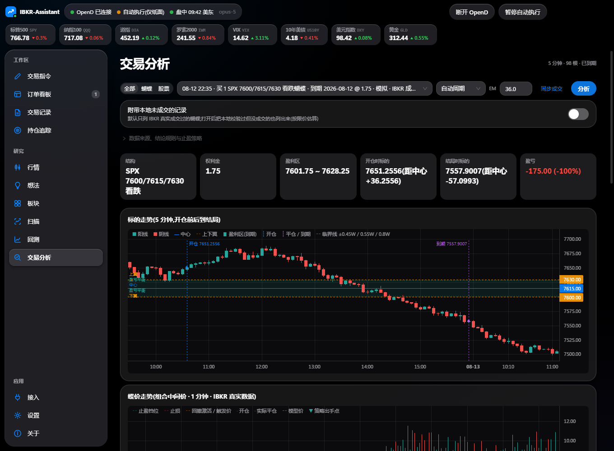

# IBKR-Assistant

用自然语言下单到 Interactive Brokers 的桌面交易台。大模型只负责把"买入 AAPL 100 股 limit 230,理由:回调到位"这样的中英混合指令翻译成结构化订单;限额、方向、账户、价差结构、时段、重复单的校验全部由代码完成,再经三道执行闸门才会发到券商。围绕下单之外,还带持仓追踪自动平仓、K 线价格行为分析、期权墙价位提醒、板块扫描、回测与交易复盘。

[](https://github.com/Dafrix69/IBKR-Assistant/actions/workflows/ci.yml)
[](LICENSE)

> 本仓库是软件实现,不构成任何投资建议。自动执行意味着解析错误会真金白银成交,请先在模拟账户跑够回归再考虑实盘。

**使用者**从 [用户手册](docs/user-guide/README.md) 看起;每一版改了什么在 [更新记录](CHANGELOG.md);
发现安全问题请按 [SECURITY.md](SECURITY.md) 私下报告。



## 功能

每个功能的设计与规则在 [docs/features](docs/features/README.md)。

**交易指令** 一句话下单:正股、期权、垂直价差、蝴蝶、铁鹰、条件单。SPX 蝴蝶行话(`1.8 挂15蝴蝶 15CM`)在本地解析,约 2 毫秒;其余交给大模型(Anthropic Claude 或任意 OpenAI 兼容端点),结构化输出之后由代码复校验。可以勾选多个账户,每个账户各发一份、各自校验。见 [交易指令](docs/features/instruction.md)、[双账户发单](docs/features/dual-account.md)。

**校验与闸门** 限额、方向、价差结构、账户、交易时段、重复单全部由代码逐条复算;「允许自动执行」与「允许实盘账户下单」默认关闭;连续失败自动熔断,手动熔断撤掉全部挂单。被拦下的单说明是谁拒的(模型、校验、引擎、券商)、为什么、去哪里打开。真实账号不进提示词。

**蝴蝶测算** 开仓之前填上一只蝶、预计标的走到的价位和时刻,按各腿的 IV 算出到时值多少、赚多少;到时的 IV 用两年多历史数据校准的模型估计,结果附「半数情况下」的区间与「IV 不变」的数。只计算,不下单。见 [蝴蝶测算](docs/features/fly-plan.md)。

**保护规则 · 执行对账 · 风险预算** 接连止损、回撤过大、日内亏损到线、同一标的刚平仓时暂停新单,只挡新单、不挡平仓,到点自己解除,默认全关。重启或重连之后,引擎把券商侧的在途单与成交对回本地记录,两边都查不到的标「去向不明」,不替你作废。一单占账户权益太多时只提醒。见 [保护规则](docs/features/protections.md)、[执行对账](docs/features/reconcile.md)、[单笔风险预算](docs/features/risk-budget.md)。

| 订单看板 | 交易记录 |
|---|---|
|  |  |

**订单看板 / 交易记录** 排队中的条件单、已提交订单、通知流;记录是只增的 SQLite(触发器禁止改删),状态、成交、佣金、盈亏按事件追加,可导出 JSON。



**持仓追踪** 对持仓设止盈、止损、跟踪止损、利润回撤(可按浮盈分档、尾盘收紧),或只填标的目标价("SPX 到 7740 就走"),由引擎按各腿的波动率每秒换算成持仓该值的价。触发后引擎发出平仓单,挂在各腿买卖价合成的立刻成交价上,没成交就逐秒让价;也可以托管到券商侧挂 GTC 单,由引擎每秒改价。盯盘在本机,软件必须开着。见 [持仓追踪](docs/features/tracker.md)。



**行情** 1 分钟到日线的实时 K 线,代码计算摆动结构、BOS / CHoCH、关键位、FVG、扫单、K 线形态,给出 −100 到 +100 的分与确认、失效条件,权重公开;图下是这个标的的盘口,页面下半可以同时关注 12 个盘口。见 [行情](docs/features/priceaction.md)。



**板块 · 价位提醒 · 异动** 输入主题由 AI 选出成分股。每只股两个开关:盯价位(期权墙、均线、52 周高低、整数关口,穿越时提醒;短期内反复碰同一条日均线也提醒)、盯异动(放量、急涨急跌、大涨大跌)。提醒用不抢焦点的置顶弹窗。见 [期权墙与价位提醒](docs/features/optionwall-alerts.md)、[反复碰均线](docs/features/ma-touch.md)、[股票池](docs/features/quality-watch.md)。



**扫描** 股票池一次扫完:RS 强度、各周期的 MACD 背离、极值偏离合成一张表;下面是强势股筛选(Minervini 趋势模板与 VCP、RS 评级、大盘方向)。见 [强势股筛选](docs/features/leaders.md)。



**回测** 五种策略,日线收盘成交、全仓进出,只作研究;可以扣每边成交成本,参数扫描看样本外与滚动前推。见 [回测成本与参数扫描](docs/features/backtest-lab.md)。



**交易分析** 蝴蝶由 IBKR 逐笔成交合成并复盘,回放止盈策略;股票按一段持仓复盘进出场位置、最大浮盈浮亏与兑现率。见 [交易分析](docs/features/tradereview.md)。

**绩效体检** 全部已了结交易的美元账本:胜率、盈亏比、期望值、R 与 SQN、回撤,按写死的规则挑出行为上的毛病;另有执行损耗、保护规则建议、分享卡片、信号成绩单。本机计算,不调模型。见 [绩效体检](docs/features/performance.md)、[信号成绩单](docs/features/signal-scorecard.md)。

**数据与安全** 交易库每天与升级之前自动备份,可以从界面恢复;配置或库坏了时给出恢复的路;发单、开闸门、放宽限额要经主进程的原生确认;发单超时报「结果未知」;日志落盘前脱敏,可以导出诊断信息;首次启动先看风险揭示与条款。见 [数据与配置的保险](docs/features/durability.md)、[确认凭据](docs/features/confirm-grants.md)、[日志脱敏与诊断信息](docs/features/diagnostics.md)、[条款同意](docs/features/consent.md)。

**其他** 想法备忘与知识总结、下单页的历史相似交易、顶栏宏观行情带、TWS / OpenD 连接检测与自动重连、新版本检查。界面是 Liquid Glass 风格,深浅色默认跟随系统,涨跌配色与玻璃透明度在「设置」里调。

## 它怎么工作

```
Electron 桌面端 ──stdio JSON-RPC──▶ 交易引擎(Node 子进程,engine-ts)──▶ TWS / IB Gateway(127.0.0.1)
   renderer ↔ contextBridge 白名单        ├─ 解析:本地速记 → 大模型            ├─ 富途 OpenD(桥待真机联调)
   IPC 发起方校验 + 敏感操作确认           ├─ 校验层 → 三道闸门 → 下单层         └─ 公开数据源(指数、宏观)
                                          └─ append-only SQLite + 熔断文件
```

- 引擎与界面之间没有监听端口,只有 stdio。RPC 分三条道:本地读写即来即答,行情类读请求并发,下单类请求严格顺序。
- 桌面端 `contextIsolation` / `sandbox` 全开,渲染层拿不到 Node;下单、改限额、连券商必须带界面确认标记。
- API Key 与富途解锁密码存系统凭证库(macOS Keychain / Windows 凭据管理器),不落配置文件。
- 引擎行为由 `engine-ts/baseline/` 里的黄金基线钉住,`npx vitest run` 全部离线跑完。

## 安装

两个平台的安装包都在 [Releases](https://github.com/Dafrix69/IBKR-Assistant/releases) 里。装的机器上**不需要 Node 或 Python**,引擎打在包里。

**Windows** x64:下载 `IBKR-Assistant-<版本>-win-x64.exe`。未签名,SmartScreen 会拦,「更多信息 → 仍要运行」。

**macOS** Apple Silicon(需 macOS 12 以上,Intel Mac 不支持):下载 `IBKR-Assistant-<版本>-mac-arm64.dmg`。
ad-hoc 签名、未公证,首次打开会提示无法验证开发者:到「系统设置 → 隐私与安全性」点「仍要打开」,或在终端执行 `xattr -dr com.apple.quarantine "/Applications/IBKR-Assistant.app"`。
在 Mac 上本地打也行:`cd desktop && npm run dist:mac`。有 Developer ID 证书时改用 `npm run dist:mac:signed`
(签名 + 公证,双击即开;要哪些环境变量、缺了会怎么提示,见 `desktop/tools/dist_mac.js` 开头),
CI 上在仓库 Secrets 里配好证书也会自动走这条路(见 `.github/workflows/package.yml` 的 `dmg` 任务)。

两个包都由 `安装包` 工作流出(`.github/workflows/package.yml`:手动 Run workflow、推 `v*` 标签、改到打包相关文件的 PR
都会触发)。推 `v*` 标签时两个包一起打,都通过了才挂到对应的 Release——任一平台挂了就不发版。
工作流不只是编译:核对 DMG 完整性与原生模块的架构、用包里的 Electron 拉起包里的引擎、
再真把应用启动 30 秒确认不闪退且引擎子进程起来了。

**运行前提**

1. IBKR 的 TWS 或 IB Gateway 已登录并打开 API(默认模拟账户端口 7497,实盘 7496)。建议先只用模拟账户。
2. 一个大模型 API Key:Anthropic,或任意 OpenAI 兼容端点。
3. 首次启动先读风险揭示与条款;之后按「交易指令」页上的就绪清单走:在「接入 → 大模型」填 Key,在「接入 → 账户」填上自己的账号,
   在「接入 → TWS」检测连接,在「设置」核对限额与开关。逐步的图文见 [用户手册 · 安装与首次配置](docs/user-guide/01-安装与首次配置.md)。

同一 IBKR 用户名在别处登录时,行情会跟着那边走,本机会拿不到 K 线;先在别处登出。

## 从源码运行

```bash
git clone https://github.com/Dafrix69/IBKR-Assistant.git dafritrade && cd dafritrade
(cd engine-ts && npm install && npm run build)     # Node >= 22
cd desktop && npm install && npm start             # 启动前会自动确认引擎已编译
```

```bash
cd engine-ts && npm run lint && npm run depcruise && npx tsc --noEmit && npx vitest run   # 引擎:lint、模块边界、单测 + 黄金回归 + RPC 契约回放,全部离线
cd desktop && npm run lint && npm run depcruise && npm run ui:typecheck                   # 界面:lint、分层、类型检查(React + TS)
cd desktop && npm run ui:preview \
  && npx electron tools/capture_pages.js renderer-react/dist-preview/index.html .uipreview/check --check   # 界面 smoke:每页各点一遍,控制台零报错
cd desktop && npm run notices:check                  # 随包的开源组件:许可都在白名单里
cd desktop && npm run release:check                  # 发版闸门:版本号、更新说明、条款文本、示例配置、开源许可
cd engine-ts && npm run probe                        # 真机只读联调:临时配置与临时库、三道闸强制关、只准调只读 RPC
```

引擎与界面各有一份分层规则(`.dependency-cruiser.cjs`,依赖只能往下流),CI 里排在 lint 之后;改代码的规矩——分层、RPC 契约四处同步、黄金基线怎么改、单文件体积预算——写在根目录的 [CLAUDE.md](CLAUDE.md)。其中三项不只是写着,还各有一条**只许变短**的测试钉着:RPC 契约(界面与引擎之间全部 89 个方法都从契约走,绕过契约编译不过)、桌面端 RPC 白名单与敏感方法表(两边双向对)、单文件体积预算。换了 IBKR 用户名或 TWS 升级之后先跑一遍 `npm run probe`:行情订阅按用户名算、不按账户,它会逐个品种把 TWS 的原话摆出来。

命令行也能用同一个引擎:`node dist/src/cli.js selftest | validate | parse | run | rpc`,危险程度递增,`run` 必须带 `--i-understand-this-places-real-orders`。

## 配置

`config/settings.json`(从 `settings.example.json` 生成,含账户映射,永不进仓库):

| 段 | 说明 |
|---|---|
| `limits` | 单笔名义金额、期权张数、市价单股数、最小置信度、价差滑点、重复单窗口 |
| `policies` | `auto_execute`、`allow_live_trading`、`allow_combo_live`、触发价复核、休市市价单策略、连续失败熔断阈值 |
| `protections` | 保护规则:止损护栏、回撤护栏、同标的冷却、日内亏损上限。默认全关,只挡新单、永不挡平仓,到点自己解除 |
| `risk_budget` | 单笔风险预算:按账户填权益,期权最坏亏损 / 股票名义金额占比超线时在订单上提醒,不拦单。默认关 |
| `connections` / `accounts` | TWS 端口与 client id;账户别名 → 真实账号,`is_paper` 决定实盘闸门。账户可以在「接入 → 账户」里配;连接只能手改 |
| `market_holidays` / `early_close_days` / `market_calendar` | 临时休市写在这里;规则算得出来的假日由内置日历补上(`config_only` 退回只认配置) |
| `symbol_aliases` / `index_symbols` | 「苹果 → AAPL」这类别名;SPX 的交易所与交易类 |
| `prompt_version` | 提示词版本,`prompts/` 下按版本号只增不改,一行回滚;`latest` = 跟着软件带的最新一版走 |

每一段配置背后的规则写在对应的功能文档里,目录见 [docs/features](docs/features/README.md)。

出问题要现场:主进程、引擎 stderr、渲染层报错都写进一份滚动日志 `main.log`(单份 4 MB;macOS 在 `~/Library/Logs/IBKR-Assistant/`,Windows 在 `userData/logs/`),落盘前抹掉账号、密钥与用户名。路径在「关于」页;「关于 → 支持 → 导出诊断信息…」把它连同版本、引擎状态、脱敏后的配置收成一份可以直接发出去的文件。

## 仓库布局

| 目录 | 内容 |
|---|---|
| `engine-ts/` | 交易引擎(TypeScript):`src/` 实现、`tests/` 测试、`baseline/` 回归基线、`examples/` 校验样例 |
| `desktop/` | Electron 桌面端:主进程、preload、`renderer-react/` 界面(React 19 + Ant Design 6,Vite 构建;壳 / 页面 / store 分层,见 `docs/features/ui.md`)、`tools/` 预览数据源 / 截图 smoke / 压测 / 打包 |
| `prompts/` | 提示词资产,按版本号只增不改 |
| `config/` | `settings.example.json` |
| `docs/` | `user-guide/` 用户手册、`legal/` 条款文本、`features/` 功能文档、`journal/` 事故记录、`briefs/` 与 `reports/` 历史文档、`screenshots/`、`release-checklist.md` |

## 状态

- IBKR 通道在模拟账户上真机核对过:连接、下单、状态与成交回报、佣金、撤单、熔断;托管蝴蝶止盈单的秒级原地改价、重启认领、成交落闩。
- 追价平仓(让价节奏、非托管平仓单改价、部分成交后改总量)目前只有离线测试,尚未在真机上核对。
- 执行对账(重启 / 重连后认领在途单)与保护规则(止损护栏、回撤护栏、同标的冷却、日内亏损上限)目前只有离线测试,尚未在真机上核对。
- 执行损耗、单笔风险预算、信号记录(2026-09-26 加的)目前只有离线测试;信号成绩单要攒够信号才有结论。
- 2026-09-27 做过一轮钱路径审计(下单校验、速记解析、持仓追踪与追价、托管单、回报落库、执行对账、保护规则、桌面端),
  修掉 30 多处会让一张单变成另一张单、或让持仓失去保护的问题,每处都有先红后绿的离线回归测试;
  改动后的规则写在各自的功能文档里(持仓追踪「熔断与已有的保护」「立即平仓」两节、交易指令、保护规则、执行对账、双账户)。
  这些改动同样只有离线测试,真机上重跑一遍 `npm run probe` 与模拟账户上的托管 / 立即平仓 / 熔断之后再上实盘。
- 2026-09-28 做了一轮商用准备(钱路径上几处只在异常时刻才暴露的漏洞、数据的备份与恢复、确认凭据、日志脱敏与诊断信息、
  条款确认、从界面配置账户、打包加固、发版闸门),做了什么、还差什么、哪些要你来定,见
  [docs/reports/commercial-readiness-2026-09-28.md](docs/reports/commercial-readiness-2026-09-28.md)。
  这些改动同样只有离线测试;打包相关的(Electron 41、熔断丝、签名版权限、安装器)要实际打一次包才验证得了。
- 富途 OpenD 通道:检测与诊断可用,下单桥在真机核对前显式不可用;接口库 `futu-api` 不随安装包发出去。
- 安装包没有开发者证书:Windows 未签名,macOS 是 ad-hoc 签名。Developer ID 签名与公证的路已经接好
  (`dist:mac:signed`、CI 的 Secrets),证书到手之前发出去的仍是 ad-hoc 包。

## 许可证

[MIT](LICENSE)。可以自由使用、修改、再分发(包括商用),保留版权与许可声明即可。软件按"原样"提供,不附带任何担保;
用它下单产生的盈亏与风险由使用者自己承担。应用首次启动时展示的风险揭示、使用条款与隐私说明在 [docs/legal](docs/legal)
(草稿,未经律师审阅)。

依赖各自沿用原来的许可证,不因本项目改变:安装包里带着一份第三方许可声明(「关于 → 支持 → 第三方许可声明」,
由 `desktop/tools/gen_notices.js` 生成)。其中 TradingView Lightweight Charts 是 Apache-2.0,按它的要求在「关于」页保留了署名。
